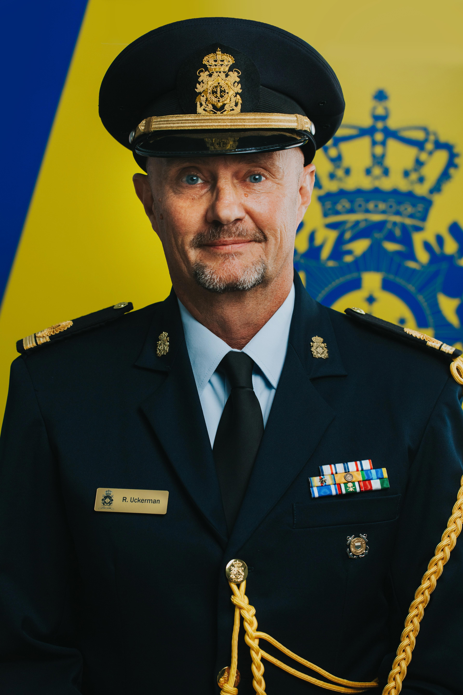
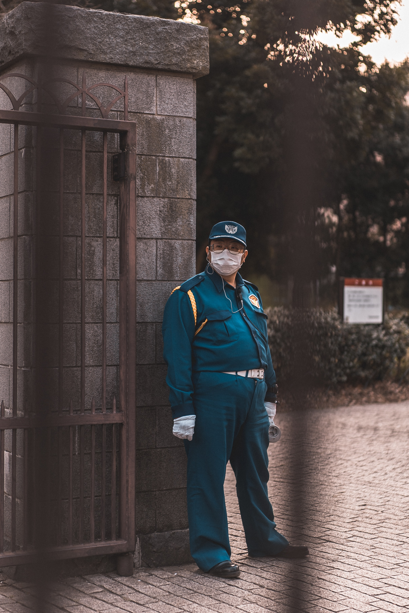
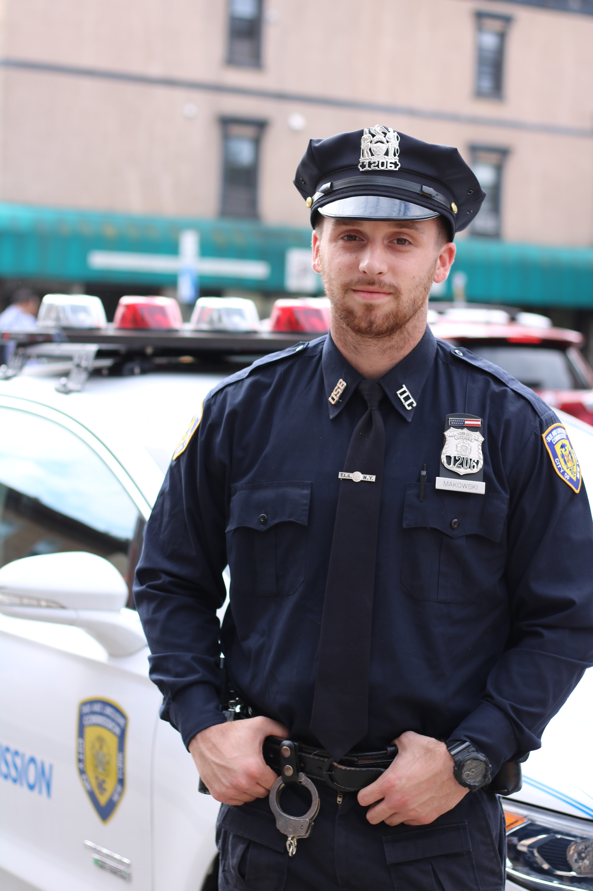

# CRAP
## Consolidated Reporting of Airman and Personnel

### Table of Contents

[Overview](https://github.com/SDI-Yankees/CRAP#overview)

[Problem Statement](https://github.com/SDI-Yankees/CRAP#problem-statement)

[How app address the problem](https://github.com/SDI-Yankees/CRAP#how-app-address-the-problem)

[User CRUD](https://github.com/SDI-Yankees/CRAP#user-crud)

[MVP](https://github.com/SDI-Yankees/CRAP#mvp)

[Target Persona](https://github.com/SDI-Yankees/CRAP#target-persona)
* [Commander](https://github.com/SDI-Yankees/CRAP#commander)
* [Supervisor](https://github.com/SDI-Yankees/CRAP#supervisor)
* [Airmen](https://github.com/SDI-Yankees/CRAP#airmen)
* [Training Manager](https://github.com/SDI-Yankees/CRAP#training-manager)
  
[Links](https://github.com/SDI-Yankees/CRAP#links)

## Overview

Team Members - Roles:

- Sam - Doc Queen
- Jeremy - Time Knight
- Eric - Git King
- Derek - User Story Clerk

### Problem Statement: 

As an airmen/service member, I don't have a central place to track and view training requirements/statuses for myself and my personnel. This then requires me to aggregate training data from multiple locations to create reports so that leadership can make more informed decisions.

### How app addresses the problem: 

### User CRUD: 

Login, view training, add training, update status, and delete

## MVP

- Login
- View: All, overdue, coming due (30 days)

## Target Persona:

### - Commander
  - Commander Uckerman

    - Occupation: Squadron Commander

    - Marital Status: Married

    - Children: 1

    - Age: 51

    - Location: Spokane, Washington

    - Commander Uckerman is a busy commander and needs a one-stop-shop to view all of his subordinate's training statuses
  
### - Supervisor
  - Dave

    - Occupation: Supervisor

    - Marital Status: Single

    - Children: 0

    - Age: 42

    - Location: Spokane, Washington

    - Dave is a busy supervisor and struggles to keep his airmen accountable for their training tasks. He is looking for a way to keep track and to delegate training tasks to his airmen.
  
### - Airman
  - Archibald Snuffy

    - Occupation: Dirtbag

    - Marital Status: Single

    - Children: 0

    - Age: 19

    - Location: Spokane, Washington

    - Fresh out of high school, Airman Snuffy is a nineteen year-old, single male who is high on life and knows everything.  He is currently living the dorms on base and drives a 1995 Honda Civic with neon lights and a broken muffler, that he secretly loves the sound that it makes.  On weekends, he hangs out with his friends at the mall, visiting Spencer's and Hot Topic multiple times.  He is interested in the stock market and has invested $133 into Dogecoin that he hopes one day will make him a thousandaire.

     Archie works in the ____ shop, learning how to Airman and work on ____.  He is unsure most days on what to do or where to go, nor does he care to learn.

### - Training Manager
  - Timothy

    - Occupation: Training Manager/Part-time Mall Cop

    - Marital Status: Single

    - Children: 7
    - Age: 30

    - Location: Spokane, Washington

    - Timothy loves chewing tobacco and drinking energy drinks. He struggles to keep up with his daily Training Manager tasks while also making time for breaks. Timothy is looking for a way to create consolidated training reports so that he can spend more time doing other fun things.   
-----------
## Links
### Google Drive
* [Yankees Docs](https://drive.google.com/drive/folders/1p-LXUwUTSlqF51-Xce5PoJ0oylkOflEd)
* [Notion](https://www.notion.so/CRAP-2b331990897d463cb9ec3bdd19192d5b)
* [Wireframes](https://app.diagrams.net/#G1bLQZJZ-UD3-1rkijzfDsOmvX4V5n7C4k)

